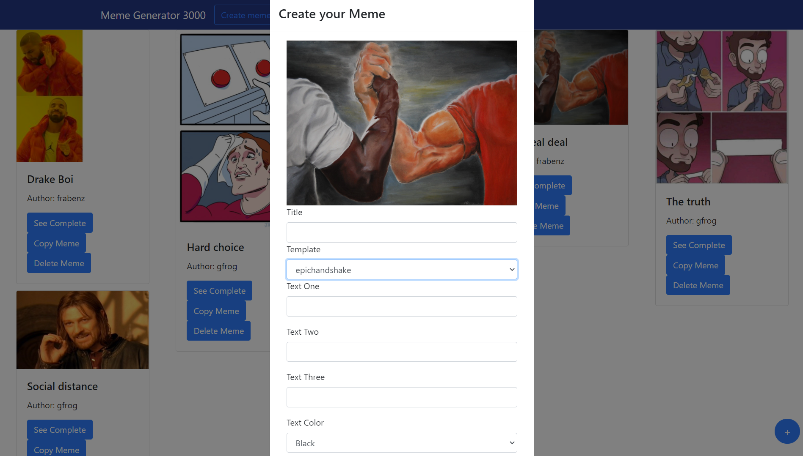

# Exam #2: "Meme Generator"

University exam for Web Applications 1 course: simple meme generator with text positioning.  
All the credentials are "fake" and used as example for showing the behaviour with example data.

## Student: s289555 Baldazzi Alessandro

## React Client Application Routes

- Route `/home`: main page, is where the list of memes is visualized and you can view/add/copy/delete a meme.
- Route `/login`: page dedicated to the login process
- Route `/`: disambiguation page, all pages not above are redirected on `/home`

## API Server

- POST `/api/sessions`
  - Permit the login for a registered user
  - POST `http:localhost:PORT/api/sessions`
  - Example Request Body: \
      { \
        &emsp; "username": "<giovannirana@polito.it>",\
        &emsp; "password": "tortelloni" \
      }
  - Example Response Body: \
      { \
        &emsp; "id": "1", \
        &emsp; "username": "<giovannirana@polito.it>", \
        &emsp; "name": "gfrog" \
      }
  - Success: 200 (Success)
  - Error: 401 (Unauthorized)
  
- DELETE `/api/sessions/current`
  - Cancel the current session / Do logout
  - POST `http:localhost:PORT/api/sessions/current`

- GET `/api/sessions/current`
  - Check if the user is logged in
  - GET `http:localhost:PORT/api/sessions/current`
  - Example Response Body: \
      { \
        &emsp; "id": "1", \
        &emsp; "username": "<giovannirana@polito.it>", \
        &emsp; "name": "gfrog" \
      }
  - Success: 200 (Success)
  - Error: 401 (Unauthorized)

- GET `/api/templates`
  - Get all templates
  - GET `http:localhost:PORT/api/templates`
  - Example Response Body: \
      { \
        &emsp; { \
          &emsp;&emsp; "id": "1", \
          &emsp;&emsp; "name": "onedoesnotsimply", \
          &emsp;&emsp; "textnum": "2", \
          &emsp;&emsp;"posone": "pos2", \
          &emsp;&emsp;"postwo": "pos8", \
          &emsp;&emsp;"posthree": "", \
        &emsp;}, \
        &emsp;{ \
          &emsp;&emsp;"id": "2", \
          &emsp;&emsp;"name": "drake", \
          &emsp;&emsp;"textnum": "2", \
          &emsp;&emsp;"posone": "pos3", \
          &emsp;&emsp;"postwo": "pos9", \
          &emsp;&emsp;"posthree": "", \
        &emsp;}, \
        ... \
      }
  - Success: 200 (Success)
  - Error: 401 (Unauthorized)

- GET `/api/memes`
  - If the user is logged get all memes, else it get all unprotected memes 
  - GET `http:localhost:PORT/api/memes`
  - Example Response Body: \
      { \
        &emsp;{ \
          &emsp;&emsp;"id" : "1", \
          &emsp;&emsp;"title" : "", \
          &emsp;&emsp;"author" : "frabenz", \
          &emsp;&emsp;"template" : "drake", \
          &emsp;&emsp;"textone" : "When you use vanilla Javascript", \
          &emsp;&emsp;"texttwo" : "When you use React", \
          &emsp;&emsp;"textthree" : "", \
          &emsp;&emsp;"color" : "Black", \
          &emsp;&emsp;"font" : "Times New Roman, Times, serif", \
          &emsp;&emsp;"protected" : "1", \
        &emsp;}, \
        &emsp;{ \
          &emsp;&emsp;... \
        &emsp;}, \
        ... \
      }
  - Success: 200 (Success)
  - Error: 401 (Unauthorized)

- DELETE `/api/memes/{id}`
  - Delete a meme if is owned by the user
  - DELETE `http:localhost:PORT/api/memes/1`
  - Example Response Body: \
      { \
        &emsp;"data" : "Ok" \
      } 
  - Success: 200 (Success)
  - Error: 500 (Internal Server Error)

- POST `/api/memes`
  - Add a new meme
  - POST `http:localhost:PORT/api/memes`
  - Example Request Body: \
      { \
        &emsp;"title": "Hard choice", \
        &emsp;"author": "gfrog", \
        &emsp;"template": "twobuttons", \
        &emsp;"textone": "Get a degree", \
        &emsp;"texttwo": "Watch all Netflix catalogue", \
        &emsp;"textthree": "", \
        &emsp;"color": "Black", \
        &emsp;"font": "Times New Roman, Times, serif", \
        &emsp;"protected": "0" \
      }
  - Success: 200 (Success)
  - Error: 500 (Internal Server Error)

- ...

## Database Tables

- Table `users` - contains id email name hash
- Table `templates` - contains id name textnum posone postwo posthree
- Table `memas` - contains id title author template textone texttwo textthree color font protected

## Main React Components

- `NavbarOuter` (in `NavbarOuter.js`): custom navbar containing buttons for login/logout and creation of a meme 
- `MemeList` (in `MemeList.js`): component for showing all available memes in the homepage using Meme components
- `MemeCreator` (in `MemeCreator.js`): component for creating a new meme, composed of a MemeView and a Form
- `MemeDescription` (in `MemeDescription.js`): component for showing a meme, composed of a MemeView and some text 
- `Meme` (in `Meme.js`): component to show a little preview of the meme, is composed by the template image and three buttons to view, copy and delete the meme
- `MemeView` (in `MemeView.js`): component for the complete view of the meme, it manages the positions of the text and other style parameters
- `Login` (in `Login.js`): component visualizing the page for the login process

(only _main_ components, minor ones may be skipped)

## Screenshot

## Users Credentials

- Email: "<giovannirana@polito.it>" , password: "tortelloni" , memes: "Why???" "The truth" "Social distance"
- Email: "<richardbenson@polito.it>" , password: "iovolevounpollo" , memes: "Drake Boi" "Hard choice" "The real deal"
